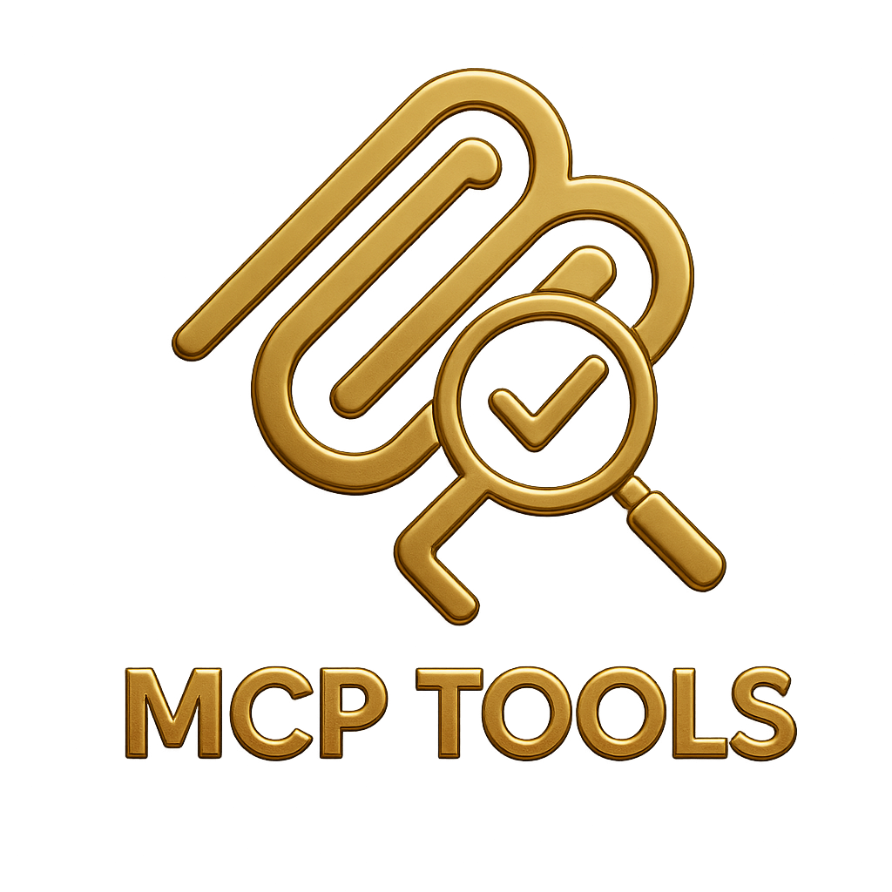
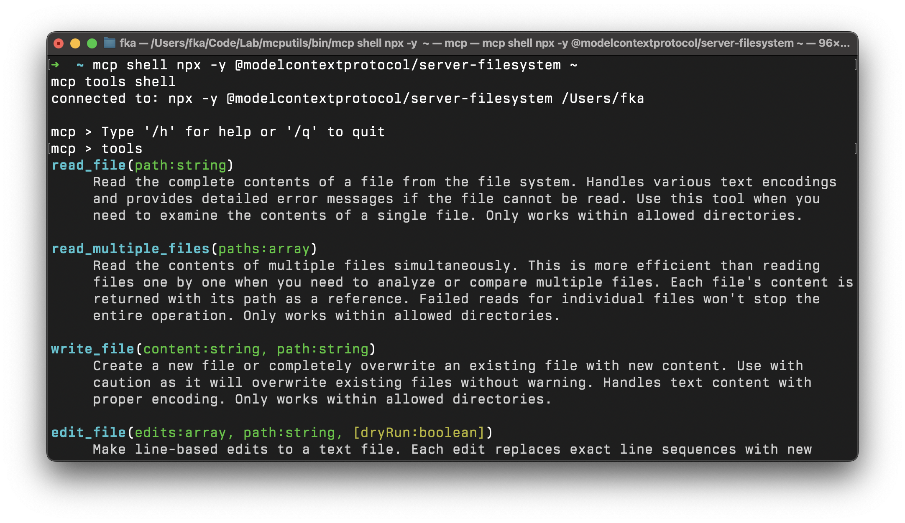

<p align="center">
  
</p>

[Read my Blog Post about MCP Tools](https://blog.fka.dev/blog/2025-03-26-introducing-mcp-tools-cli/)

A command-line interface for interacting with MCP (Model Context Protocol)
servers using stdio transport.

## Overview

```bash
mcp shell npx -y @modelcontextprotocol/server-filesystem ~
```

This will open a shell as following:



## Installation

### Using Homebrew

```bash
brew tap f/mcptools
brew install mcp
```

> ❕ The binary is installed as `mcp` but can also be accessed as `mcpt` to avoid conflicts with other tools that might use the `mcp` command name.

### From Source

```bash
go install github.com/f/mcptools/cmd/mcptools@latest
```

The binary will be installed as `mcptools` but can be aliased to `mcpt` for convenience and to avoid conflicts with other tools that might use the `mcp` command name.

## Usage

    MCP is a command line interface for interacting with MCP servers.
    It allows you to discover and call tools, list resources, and interact with MCP-compatible services.
    
    Usage:
      mcp [command]
      
    Available Commands:
      call           Call a tool, resource, or prompt on the MCP server
      help           Help about any command
      mock           Create a mock MCP server with tools, prompts, and resources
      prompts        List available prompts on the MCP server
      resources      List available resources on the MCP server
      shell          Start an interactive shell for MCP commands
      tools          List available tools on the MCP server
      version        Print the version information
      
    Flags:
      -f, --format string   Output format (table, json, pretty) (default "table")
      -h, --help            Help for mcp
      -p, --params string   JSON string of parameters to pass to the tool (default "{}")


## Transport Options

MCP currently supports two transport method for communicating with MCP servers:

### Stdio Transport

Uses stdin/stdout to communicate with an MCP server via JSON-RPC 2.0. This is
useful for command-line tools that implement the MCP protocol.

```bash
mcp tools npx -y @modelcontextprotocol/server-filesystem ~
```

### Http SSE Transport

Uses HTTP and Server-Sent Events (SSE) to communicate with an MCP server via JSON-RPC 2.0.
This is useful for connecting to remote server that implement the MCP protocol.

```
mcp tools http://127.0.0.1:3001

# As an example, you can use the everything sample server
# docker run -p 3001:3001 --rm -it tzolov/mcp-everything-server:v1
```

_Note:_ Currently HTTP SSE supports only MCP protocol version 2024-11-05.

## Output Formats

MCP supports three output formats:

### Table Format (Default)

Displays the output in a table-like view for better readability.

```bash
mcp tools npx -y @modelcontextprotocol/server-filesystem ~
```

### JSON Format

Displays the output as compact JSON.

```bash
mcp tools --format json npx -y @modelcontextprotocol/server-filesystem ~
```

### Pretty Format

Displays the output as indented JSON.

```bash
mcp tools --format pretty npx -y @modelcontextprotocol/server-filesystem ~
```

## Commands

### List Available Tools

```bash
mcp tools npx -y @modelcontextprotocol/server-filesystem ~
```

### List Available Resources

```bash
mcp resources npx -y @modelcontextprotocol/server-filesystem ~
```

### List Available Prompts

```bash
mcp prompts npx -y @modelcontextprotocol/server-filesystem ~
```

### Call a Tool

```bash
mcp call read_file --params '{"path": "/path/to/file"}' npx -y @modelcontextprotocol/server-filesystem ~
```

### Call a Resource

```bash
mcp call resource:my-resource npx -y @modelcontextprotocol/server-filesystem ~
```

### Call a Prompt

```bash
mcp call prompt:my-prompt npx -y @modelcontextprotocol/server-filesystem ~
```

### Interactive Shell Mode

Start an interactive shell for executing multiple MCP commands:

```bash
mcp shell npx -y @modelcontextprotocol/server-filesystem ~
```

This opens an interactive shell where you can run MCP commands:

    mcp > connected to MCP server over stdio
    mcp > Type '/h' for help or '/q' to quit
    mcp > tools
    NAME        DESCRIPTION
    ----        -----------
    read_file   Reads a file from the filesystem
    ...
    
    mcp > call read_file --params '{"path": "README.md"}'
    ...content of README.md...
    
    # Direct tool calling is supported
    mcp > read_file {"path": "README.md"}
    ...content of README.md...
    
    mcp > /h
    MCP Shell Commands:
      tools                      List available tools
      resources                  List available resources
      prompts                    List available prompts
      call <entity> [--params '{...}']  Call a tool, resource, or prompt
      format [json|pretty|table] Get or set output format
    Special Commands:
      /h, /help                  Show this help
      /q, /quit, exit            Exit the shell
      
    mcp > /q
    Exiting MCP shell

### Mock Server Mode

Create a mock MCP server for testing clients without implementing a full server:

```bash
# Create a mock server with a simple tool
mcp mock tool hello_world "A simple greeting tool"

# Create a mock server with a tool, prompt, and resource
mcp mock tool hello_world "A greeting tool" \
       prompt welcome "A welcome prompt" "Hello {{name}}, welcome to {{location}}!" \
       resource docs://readme "Documentation" "Mock MCP Server\nThis is a mock server"
```

The mock server implements the MCP protocol with:
- Full initialization handshake (initialize method)
- Tool listing with standardized schema format
- Tool calling with simple responses
- Resource listing and reading with proper format
- Prompt listing and retrieving with proper format, including arguments
- Detailed request/response logging to `~/.mcpt/logs/mock.log`

For prompts, any text in `{{double_braces}}` is automatically detected as an argument:

```bash
# Create a prompt with name and location arguments
mcp mock prompt greeting "Greeting template" "Hello {{name}}! Welcome to {{location}}."
```

When a client requests the prompt, it can provide values for these arguments which will be substituted in the response.

## Examples

List tools from a filesystem server:

```bash
mcp tools npx -y @modelcontextprotocol/server-filesystem ~
```

Call the read_file tool with pretty JSON output:

```bash
mcp call read_file --params '{"path": "README.md"}' --format pretty npx -y @modelcontextprotocol/server-filesystem ~
```

Using the interactive shell mode:

```bash
mcp shell npx -y @modelcontextprotocol/server-filesystem ~
```

Creating a mock server for testing:

```bash
# Create a mock server with multiple entity types
mcp mock tool file_reader "Reads files" \
      prompt code_review "Code review prompt" "Please review this {{language}} code: {{code}}" \
      resource docs://api "API Documentation" "# API Reference\n\nThis document describes the API."
```

## Contributing

We welcome contributions! Please see our [Contributing Guidelines](CONTRIBUTING.md) 
for details on how to submit pull requests, report issues, and contribute to the 
project.

## Roadmap

The following features are planned for future releases:

- Authentication: Support for secure authentication mechanisms

## License

This project is licensed under MIT
