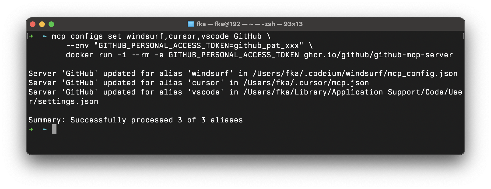

<p align="center">
  
</p>

<p align="center">
  <h1 align="center">Swiss Army Knife for MCP Servers</h1>
  <p align="center">
    A comprehensive command-line interface for interacting with MCP (Model Context Protocol) servers.
    <br>
    Discover, call, and manage tools, resources, and prompts from any MCP-compatible server.
    <br>
    Supports multiple transport methods, output formats, and includes powerful mock and proxy server capabilities.
  </p>
</p>

[](https://blog.fka.dev/blog/2025-03-27-mcp-inspector-vs-mcp-tools/)

## Table of Contents

- [Overview](#overview)
- [Difference Between the MCP Inspector and MCP Tools](https://blog.fka.dev/blog/2025-03-27-mcp-inspector-vs-mcp-tools/)
- [Installation](#installation)
  - [Using Homebrew](#using-homebrew)
  - [From Source](#from-source)
- [Getting Started](#getting-started)
- [Features](#features)
  - [Transport Options](#transport-options)
  - [Output Formats](#output-formats)
  - [Commands](#commands)
  - [Interactive Shell](#interactive-shell)
  - [Project Scaffolding](#project-scaffolding)
- [Server Aliases](#server-aliases)
- [LLM Apps Config Management](#llm-apps-config-management)
- [Server Modes](#server-modes)
  - [Mock Server Mode](#mock-server-mode)
  - [Proxy Mode](#proxy-mode)
  - [Guard Mode](#guard-mode)
- [Examples](#examples)
  - [Basic Usage](#basic-usage)
  - [Script Integration](#script-integration)
  - [Debugging](#debugging)
- [Contributing](#contributing)
- [Roadmap](#roadmap)
- [License](#license)

## Overview

MCP Tools provides a versatile CLI for working with Model Context Protocol (MCP) servers. It enables you to:

- Discover and call tools provided by MCP servers
- Access and utilize resources exposed by MCP servers
- Create mock servers for testing client applications
- Proxy MCP requests to shell scripts for easy extensibility
- Create interactive shells for exploring and using MCP servers
- Scaffold new MCP projects with TypeScript support
- Format output in various styles (JSON, pretty-printed, table)
- Guard and restrict access to specific tools and resources
- Support all transport methods (HTTP, stdio)

<p align="center">
  
</p>

## Installation

### Using Homebrew

```bash
brew tap f/mcptools
brew install mcp
```

> ❕ The binary is installed as `mcp` but can also be accessed as `mcpt` to avoid conflicts with other tools that might use the `mcp` command name.

### From Source

```bash
go install github.com/f/mcptools/cmd/mcptools@latest
```

The binary will be installed as `mcptools` but can be aliased to `mcpt` for convenience.

## Getting Started

The simplest way to start using MCP Tools is to connect to an MCP server and list available tools:

```bash
# List all available tools from a filesystem server
mcp tools npx -y @modelcontextprotocol/server-filesystem ~

# Call a specific tool
mcp call read_file --params '{"path":"README.md"}' npx -y @modelcontextprotocol/server-filesystem ~

# Open an interactive shell
mcp shell npx -y @modelcontextprotocol/server-filesystem ~
```

## Features

MCP Tools supports a wide range of features for interacting with MCP servers:

```
Usage:
  mcp [command]

Available Commands:
  version       Print the version information
  tools         List available tools on the MCP server
  resources     List available resources on the MCP server
  prompts       List available prompts on the MCP server
  call          Call a tool, resource, or prompt on the MCP server
  get-prompt    Get a prompt on the MCP server
  read-resource Read a resource on the MCP server
  shell         Start an interactive shell for MCP commands
  mock          Create a mock MCP server with tools, prompts, and resources
  proxy         Proxy MCP tool requests to shell scripts
  alias         Manage MCP server aliases
  configs       Manage MCP server configurations
  new           Create a new MCP project component
  help          Help about any command
  completion    Generate the autocompletion script for the specified shell

Flags:
  -f, --format string   Output format (table, json, pretty) (default "table")
  -h, --help            help for mcp
  -p, --params string   JSON string of parameters to pass to the tool (for call command) (default "{}")

Use "mcp [command] --help" for more information about a command.
```

### Transport Options

MCP Tools supports multiple transport methods for communicating with MCP servers:

#### Stdio Transport

Uses stdin/stdout to communicate with an MCP server via JSON-RPC 2.0. This is useful for command-line tools that implement the MCP protocol.

```bash
mcp tools npx -y @modelcontextprotocol/server-filesystem ~
```

#### HTTP SSE Transport

Uses HTTP and Server-Sent Events (SSE) to communicate with an MCP server via JSON-RPC 2.0. This is useful for connecting to remote servers that implement the MCP protocol.

```bash
mcp tools http://127.0.0.1:3001

# Example: Use the everything sample server
# docker run -p 3001:3001 --rm -it tzolov/mcp-everything-server:v1
```

_Note:_ HTTP SSE currently supports only MCP protocol version 2024-11-05.

### Output Formats

MCP Tools supports three output formats to accommodate different needs:

#### Table Format (Default)

```bash
mcp tools npx -y @modelcontextprotocol/server-filesystem ~
```

The default format now displays tools in a colorized man-page style:

```
read_file(path:str, [limit:int], [offset:int])
     Reads a file from the filesystem

list_dir(path:str)
     Lists directory contents

grep_search(pattern:str, [excludePatterns:str[]])
     Search files with pattern

edit_file(edits:{newText:str,oldText:str}[], path:str)
     Edit a file with multiple text replacements
```

Key features of the format:
- Function names are displayed in bold cyan
- Required parameters are shown in green (e.g., `path:str`)
- Optional parameters are shown in yellow brackets (e.g., `[limit:int]`)
- Array types are indicated with `[]` suffix (e.g., `str[]`)
- Object types show their properties in curly braces (e.g., `{prop1:type1,prop2:type2}`)
- Nested objects are displayed recursively (e.g., `{notifications:{enabled:bool,sound:bool}}`)
- Type names are shortened for readability (e.g., `str` instead of `string`, `int` instead of `integer`)
- Descriptions are indented and displayed in gray
- Parameter order is consistent, with required parameters listed first

#### JSON Format (Compact)

```bash
mcp tools --format json npx -y @modelcontextprotocol/server-filesystem ~
```

#### Pretty JSON Format (Indented)

```bash
mcp tools --format pretty npx -y @modelcontextprotocol/server-filesystem ~
```

### Commands

MCP Tools includes several core commands for interacting with MCP servers:

#### List Available Tools

```bash
mcp tools npx -y @modelcontextprotocol/server-filesystem ~
```

#### List Available Resources

```bash
mcp resources npx -y @modelcontextprotocol/server-filesystem ~
```

#### List Available Prompts

```bash
mcp prompts npx -y @modelcontextprotocol/server-filesystem ~
```

#### Call a Tool

```bash
mcp call read_file --params '{"path":"/path/to/file"}' npx -y @modelcontextprotocol/server-filesystem ~
```

#### Call a Resource

```bash
mcp call resource:test://static/resource/1 npx -y @modelcontextprotocol/server-everything -f json | jq ".contents[0].text"
```

or 

```bash
mcp read-resource test://static/resource/1 npx -y @modelcontextprotocol/server-everything -f json | jq ".contents[0].text"
```

#### Call a Prompt

```bash
mcp get-prompt simple_prompt npx -y @modelcontextprotocol/server-everything -f json | jq ".messages[0].content.text"
```

### Interactive Shell

The interactive shell mode allows you to run multiple MCP commands in a single session:

```bash
mcp shell npx -y @modelcontextprotocol/server-filesystem ~
```

This opens an interactive shell with the following capabilities:

```
mcp tools shell
connected to: npx -y @modelcontextprotocol/server-filesystem /Users/fka

mcp > Type '/h' for help or '/q' to quit
mcp > tools
read_file(path:str, [limit:int], [offset:int])
     Reads a file from the filesystem

list_dir(path:str)
     Lists directory contents

grep_search(pattern:str, [excludePatterns:str[]])
     Search files with pattern

edit_file(edits:{newText:str,oldText:str}[], path:str)
     Edit a file with multiple text replacements

# Direct tool calling is supported
mcp > read_file {"path":"README.md"}
...content of README.md...

# Calling a tool with complex object parameters
mcp > edit_file {"path":"main.go","edits":[{"oldText":"foo","newText":"bar"}]}
...result of edit operation...

# Get help
mcp > /h
MCP Shell Commands:
  tools                      List available tools
  resources                  List available resources
  prompts                    List available prompts
  call <entity> [--params '{...}']  Call a tool, resource, or prompt
  format [json|pretty|table] Get or set output format
Special Commands:
  /h, /help                  Show this help
  /q, /quit, exit            Exit the shell
```

### Project Scaffolding

MCP Tools provides a scaffolding feature to quickly create new MCP servers with TypeScript:

```bash
mkdir my-mcp-server
cd my-mcp-server

# Create a project with specific components
mcp new tool:calculate resource:file prompt:greet

# Create a project with a specific SDK (currently only TypeScript/ts supported)
mcp new tool:calculate --sdk=ts

# Create a project with a specific transport type
mcp new tool:calculate --transport=stdio
mcp new tool:calculate --transport=sse
```

The scaffolding creates a complete project structure with:

- Server setup with chosen transport (stdio or SSE)
- TypeScript configuration with modern ES modules
- Component implementations with proper MCP interfaces
- Automatic wiring of imports and initialization

After scaffolding, you can build and run your MCP server:

```bash
# Install dependencies
npm install

# Build the TypeScript code
npm run build 

# Test the server with MCP Tools
mcp tools node build/index.js
```

Project templates are stored in either:
- Local `./templates/` directory
- User's home directory: `~/.mcpt/templates/`
- Homebrew installation path (`/opt/homebrew/Cellar/mcp/v#.#.#/templates`)

When installing via Homebrew, templates are automatically installed to your home directory. But if you use source install, you need to run `make install-templates`.

## Server Aliases

MCP Tools allows you to save and reuse server commands with friendly aliases:

```bash
# Add a new server alias
mcp alias add myfs npx -y @modelcontextprotocol/server-filesystem ~/

# List all registered server aliases
mcp alias list

# Remove a server alias
mcp alias remove myfs

# Use an alias with any MCP command
mcp tools myfs
mcp call read_file --params '{"path":"README.md"}' myfs
```

Server aliases are stored in `$HOME/.mcpt/aliases.json` and provide a convenient way to work with commonly used MCP servers without typing long commands repeatedly.

## LLM Apps Config Management

MCP Tools provides a powerful configuration management system that helps you work with MCP server configurations across multiple applications:

> 🚧 This works only on macOS for now.

```bash
# Scan for MCP server configurations across all supported applications
mcp configs scan

# List all configurations (alias for configs view --all)
mcp configs ls

# View specific configuration by alias
mcp configs view vscode

# Add or update a server in a configuration
mcp configs set vscode my-server npm run mcp-server
mcp configs set cursor my-api https://api.example.com/mcp --headers "Authorization=Bearer token"

# Add to multiple configurations at once
mcp configs set vscode,cursor,claude-desktop my-server npm run mcp-server

# Remove a server from a configuration
mcp configs remove vscode my-server

# Create an alias for a custom config file
mcp configs alias myapp ~/myapp/config.json

# Synchronize and merge configurations from multiple sources
mcp configs sync vscode cursor --output vscode --default interactive

# Convert a command line to MCP server JSON configuration format
mcp configs as-json mcp proxy start
# Output: {"command":"mcp","args":["proxy","start"]}

# Convert a URL to MCP server JSON configuration format
mcp configs as-json https://api.example.com/mcp --headers "Authorization=Bearer token"
# Output: {"url":"https://api.example.com/mcp","headers":{"Authorization":"Bearer token"}}
```

Configurations are managed through a central registry in `$HOME/.mcpt/configs.json` with predefined aliases for:
- VS Code and VS Code Insiders
- Windsurf
- Cursor
- Claude Desktop and Claude Code

The system automatically displays server configurations in a colorized format grouped by source, showing command-line or URL information, headers, and environment variables.

`mcp configs scan` command looks for MCP server configurations in:
- Visual Studio Code
- Visual Studio Code Insiders
- Windsurf
- Cursor
- Claude Desktop

Example Output:
```
VS Code Insiders
  GitHub (stdio):
    docker run -i --rm -e GITHUB_PERSONAL_ACCESS_TOKEN ghcr.io/github/github-mcp-server

Claude Desktop
  Proxy (stdio):
    mcp proxy start

  My Files (stdio):
    npx -y @modelcontextprotocol/server-filesystem ~/
```

### Bonus

Add official GitHub MCP Server to Windsurf, Cursor and VS Code at once:

```bash
mcp configs set windsurf,cursor,vscode GitHub \
  --env "GITHUB_PERSONAL_ACCESS_TOKEN=github_pat_xxx" \
  docker run -i --rm -e GITHUB_PERSONAL_ACCESS_TOKEN ghcr.io/github/github-mcp-server
```

<p align="center">
  
</p>

## Server Modes

MCP Tools can operate as both a client and a server, with two server modes available:

### Mock Server Mode

The mock server mode creates a simulated MCP server for testing clients without implementing a full server:

```bash
# Create a mock server with a simple tool
mcp mock tool hello_world "A simple greeting tool"

# Create a mock server with multiple entity types
mcp mock tool hello_world "A greeting tool" \
       prompt welcome "A welcome prompt" "Hello {{name}}, welcome to {{location}}!" \
       resource docs://readme "Documentation" "Mock MCP Server\nThis is a mock server"
```

Features of the mock server:

- Full initialization handshake
- Tool listing with standardized schema
- Tool calling with simple responses
- Resource listing and reading
- Prompt listing and retrieval with argument substitution
- Detailed request/response logging to `~/.mcpt/logs/mock.log`

#### Using Prompt Templates

For prompts, any text in `{{double_braces}}` is automatically detected as an argument:

```bash
# Create a prompt with name and location arguments
mcp mock prompt greeting "Greeting template" "Hello {{name}}! Welcome to {{location}}."
```

When a client requests the prompt, it can provide values for these arguments which will be substituted in the response.

### Proxy Mode

The proxy mode allows you to register shell scripts or inline commands as MCP tools, making it easy to extend MCP functionality without writing code:

```bash
# Register a shell script as an MCP tool
mcp proxy tool add_operation "Adds a and b" "a:int,b:int" ./examples/add.sh

# Register an inline command as an MCP tool
mcp proxy tool add_operation "Adds a and b" "a:int,b:int" -e 'echo "total is $a + $b = $(($a+$b))"'

# Unregister a tool
mcp proxy tool --unregister add_operation

# Start the proxy server
mcp proxy start
```

Running `mcp tools localhost:3000` with the proxy server will show the registered tools with their parameters:

```
add_operation(a:int, b:int)
     Adds a and b

count_files(dir:str, [include:str[]])
     Counts files in a directory with optional filters
```

This new format clearly shows what parameters each tool accepts, making it easier to understand how to use them. Arrays are denoted with `[]` suffix (e.g., `str[]`), and type names are shortened for better readability.

#### How It Works

1. Register a shell script or inline command with a tool name, description, and parameter specification
2. Start the proxy server, which implements the MCP protocol
3. When a tool is called, parameters are passed as environment variables to the script/command
4. The script/command's output is returned as the tool response

#### Example Scripts and Commands

**Adding Numbers (add.sh):**

```bash
#!/bin/bash
# Get values from environment variables
if [ -z "$a" ] || [ -z "$b" ]; then
  echo "Error: Missing required parameters 'a' or 'b'"
  exit 1
fi

# Perform the addition
result=$(($a + $b))
echo "The sum of $a and $b is $result"
```

**Inline Command Example:**

```bash
# Simple addition
mcp proxy tool add_op "Adds given numbers" "a:int,b:int" -e 'echo "total is $a + $b = $(($a+$b))"'

# Customized greeting
mcp proxy tool greet "Greets a user" "name:string,greeting:string,formal:bool" -e '
if [ "$formal" = "true" ]; then
  title="Mr./Ms."
  echo "${greeting:-Hello}, ${title} ${name}. How may I assist you today?"
else
  echo "${greeting:-Hello}, ${name}! Nice to meet you!"
fi
'

# File operations
mcp proxy tool count_lines "Counts lines in a file" "file:string" -e "wc -l < \"$file\""
```

#### Configuration and Logging

- Tools are registered in `~/.mcpt/proxy_config.json`
- The proxy server logs all requests and responses to `~/.mcpt/logs/proxy.log`
- Use `--unregister` to remove a tool from the configuration

### Guard Mode

The guard mode allows you to restrict access to specific tools, prompts, and resources based on pattern matching. This is useful for security purposes when:

- Restricting potentially dangerous operations (file writes, deletions, etc.)
- Limiting the capabilities of AI assistants or applications 
- Providing read-only access to sensitive systems
- Creating sandboxed environments for testing or demonstrations

> **Note:** Guard mode currently only works with STDIO transport (command execution) and not HTTP transport.

```bash
# Allow only file reading operations, deny file modifications
mcp guard --allow 'tools:read_* --deny tools:write_*,create_*,delete_*' npx -y @modelcontextprotocol/server-filesystem ~

# Permit only a single specific tool
mcp guard --allow 'tools:search_files' npx -y @modelcontextprotocol/server-filesystem ~

# Restrict by both tool type and prompt type
mcp guard --allow 'tools:read_*,prompts:system_*' --deny tools:execute_* npx -y @modelcontextprotocol/server-filesystem ~

# Using with aliases
mcp guard --allow 'tools:read_*' fs  # Where 'fs' is an alias for a filesystem server
```

#### How It Works

The guard command works by:
1. Creating a proxy that sits between the client and the MCP server
2. Intercepting and filtering all requests to `tools/list`, `prompts/list`, and `resources/list`
3. Preventing calls to tools, prompts, or resources that don't match the allowed patterns
4. Blocking requests for filtered resources, tools and prompts
6. Passing through all other requests and responses unchanged

#### Pattern Matching

Patterns use simple glob syntax with `*` as a wildcard:

- `tools:read_*` - Matches all tools starting with "read_"
- `tools:*file*` - Matches any tool with "file" in the name
- `prompts:system_*` - Matches all prompts starting with "system_"

For each entity type, you can specify:
- `--allow 'pattern1,pattern2,...'` - Only allow entities matching these patterns
- `--deny 'pattern1,pattern2,...'` - Remove entities matching these patterns

If no allow patterns are specified, all entities are allowed by default (except those matching deny patterns).

#### Application Integration

You can use the guard command to secure MCP configurations in applications. For example, to restrict a file system server to only allow read operations, change:

```json
"filesystem": {
  "command": "npx",
  "args": [
    "-y",
    "@modelcontextprotocol/server-filesystem",
    "/Users/fka/Desktop"
  ]
}
```

To:

```json
"filesystem": {
  "command": "mcp",
  "args": [
    "guard", "--deny", "tools:write_*,create_*,move_*,delete_*",
    "npx", "-y", "@modelcontextprotocol/server-filesystem",
    "/Users/fka/Desktop"
  ]
}
```

This provides a read-only view of the filesystem by preventing any modification operations.

You can also use aliases with the guard command in configurations:

```json
"filesystem": {
  "command": "mcp",
  "args": [
    "guard", "--allow", "tools:read_*,list_*,search_*",
    "fs"  // Where 'fs' is an alias for the filesystem server
  ]
}
```

This makes your configurations even more concise and easier to maintain.

#### Logging

- Guard operations are logged to `~/.mcpt/logs/guard.log`
- The log includes all requests, responses, and filtering decisions
- Use `tail -f ~/.mcpt/logs/guard.log` to monitor activity in real-time

## Examples

### Basic Usage

List tools from a filesystem server:

```bash
mcp tools npx -y @modelcontextprotocol/server-filesystem ~
```

Call a tool with pretty JSON output:

```bash
mcp call read_file --params '{"path":"README.md"}' --format pretty npx -y @modelcontextprotocol/server-filesystem ~
```

Use the guard mode to filter available tools:

```bash
# Only allow file search functionality
mcp guard --allow tools:search_files npx -y @modelcontextprotocol/server-filesystem ~

# Create a read-only environment
mcp guard --deny tools:write_*,delete_*,create_*,move_* npx -y @modelcontextprotocol/server-filesystem ~
```

### Script Integration

Using the proxy mode with a simple shell script:

```bash
# 1. Create a simple shell script for addition
cat > add.sh << 'EOF'
#!/bin/bash
# Get values from environment variables
if [ -z "$a" ] || [ -z "$b" ]; then
  echo "Error: Missing required parameters 'a' or 'b'"
  exit 1
fi
result=$(($a + $b))
echo "The sum of $a and $b is $result"
EOF

# 2. Make it executable
chmod +x add.sh

# 3. Register it as an MCP tool
mcp proxy tool add_numbers "Adds two numbers" "a:int,b:int" ./add.sh

# 4. In one terminal, start the proxy server
mcp proxy start

# 5. In another terminal, you can call it as an MCP tool
mcp call add_numbers --params '{"a":5,"b":3}' --format pretty
```

### Debugging

Tailing the logs to debug your proxy or mock server:

```bash
# For the mock server logs
tail -f ~/.mcpt/logs/mock.log

# For the proxy server logs
tail -f ~/.mcpt/logs/proxy.log

# To watch all logs in real-time (on macOS/Linux)
find ~/.mcpt/logs -name "*.log" -exec tail -f {} \;
```

## Contributing

We welcome contributions! Please see our [Contributing Guidelines](CONTRIBUTING.md) for details on how to submit pull requests, report issues, and contribute to the project.

## Roadmap

The following features are planned for future releases:

- Authentication: Support for secure authentication mechanisms

## License

This project is licensed under the MIT License.

## Thanks

Thanks to [Fatih Taskiran](https://bsky.app/profile/fatih.co) for the logo design.
